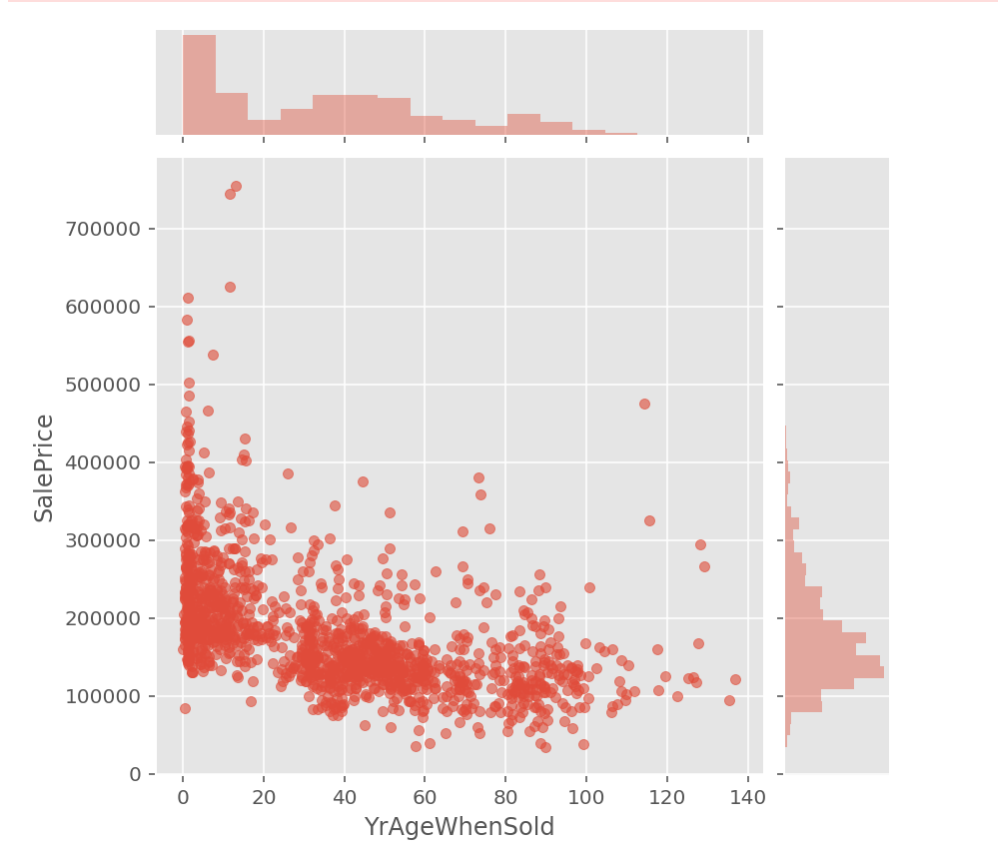
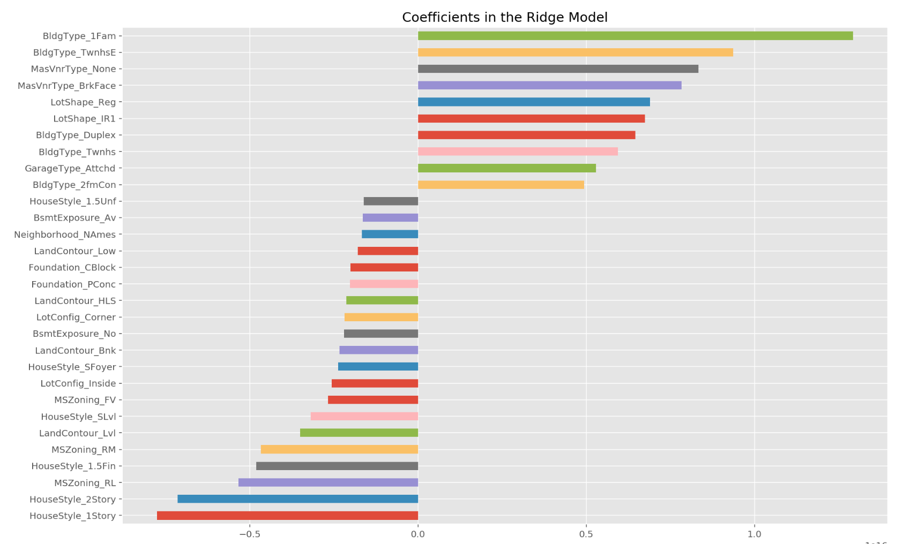

# Housing price prediction

The aim of the project is building a reliable estimator for the price of the house given characteristics of the house.
The dataset contains housing sale data with a huge amount of features identifying different aspects of the house. 

## Project walkthrough

1. [Cleaning, feature engineering, and EDA](https://github.com/Klariss/housing_prices/blob/master/EDA%20and%20Cleaning.ipynb)
2. [Modeling I. part](https://github.com/Klariss/housing_prices/blob/master/Modeling%20I.%20part.ipynb)
3. [Modeling II. part](https://github.com/Klariss/housing_prices/blob/master/Modeling%20II.%20part.ipynb)

### [Cleaning, feature engineering, and EDA](https://github.com/Klariss/housing_prices/blob/master/EDA%20and%20Cleaning.ipynb)

I explored important variables and examined their possible relation to the prediction process, 
also I dealt with the missing values.

### [Modeling I. part](https://github.com/Klariss/housing_prices/blob/master/Modeling%20I.%20part.ipynb)

The first part of the modeling is about estimating the value of homes from fixed characteristics. 
Then the second part of the modelling is to determine any value of changeable property characteristics unexplained 
by the fixed ones.

The training of the model happened on pre-2010 data and the performance evaluation is on the 2010 houses. 
For the modeling I used Logistic regression with Ridge CV. Feature importances are represented below.

### [Modeling II. part](https://github.com/Klariss/housing_prices/blob/master/Modeling%20II.%20part.ipynb)

The goal here is to determine any value of changeable property characteristics unexplained by the fixed ones.
The residuals from the first model (training and testing) represent the variance in price unexplained by the fixed characteristics.
First I had to get out the residuals for training and testing, in terms of dollars. Then examine that of that variance 
in price remaining, how much of it can be explained by the easy-to-change aspects of the property.
By my choice of things that could be done via renovation and building on a Logistic Regresion model this value is 19%.
We can use the estimated important features to evaluate how much in dollars a renovation is worth. 

